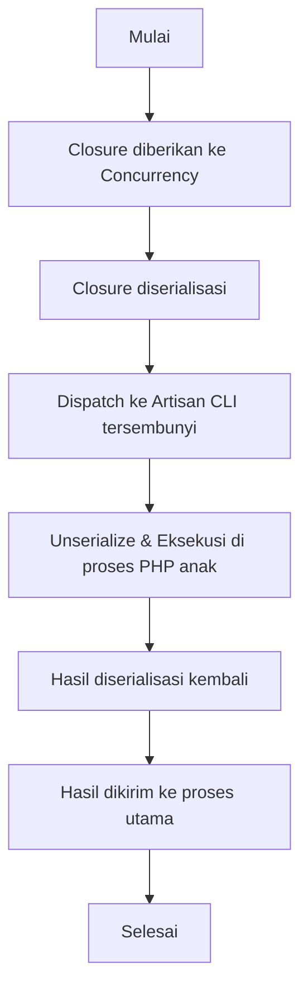

# ⚡ Concurrency di Laravel 🚀

## 😊 Pendahuluan

Dalam pengembangan aplikasi, sering kali kita perlu menjalankan beberapa tugas yang lambat secara bersamaan. Misalnya, menghitung jumlah data pada tabel berbeda, atau melakukan request ke layanan eksternal yang tidak saling bergantung. Jika semua tugas tersebut dijalankan secara berurutan, performa aplikasi dapat menurun.

Untuk mengatasi hal ini, **Laravel** menyediakan *facade* `Concurrency` yang menawarkan API sederhana dan nyaman untuk mengeksekusi *closure* secara konkuren (concurrent).


## 🔎 Cara Kerja

Laravel menangani concurrency dengan cara berikut:

1. *Closure* yang diberikan akan diserialisasi.
2. Laravel akan mendispatch closure tersebut ke perintah CLI Artisan tersembunyi.
3. Closure akan di-*unserialize* dan dijalankan pada proses PHP terpisah.
4. Hasil dari closure akan diserialisasi kembali ke proses utama.

Laravel mendukung tiga jenis *driver* untuk concurrency:

* **process** (default)
* **fork**
* **sync**

### 🌀 Driver **Process**

Driver default yang menggunakan proses PHP baru untuk setiap closure.

### ⚡ Driver **Fork**

Driver ini memberikan performa lebih baik dibanding driver default, tetapi hanya dapat digunakan pada konteks **CLI**. PHP tidak mendukung *forking* selama permintaan HTTP biasa.

Sebelum menggunakan driver ini, Anda harus menginstal package berikut:

```bash
composer require spatie/fork
```

### 🧪 Driver **Sync**

Driver ini sangat berguna saat pengujian, karena menonaktifkan semua concurrency dan menjalankan closure secara berurutan dalam proses utama.


## 📊 Diagram Alur Concurrency

Berikut alur sederhana bagaimana concurrency bekerja di Laravel:




## ▶️ Menjalankan Tugas Konkuren

Untuk menjalankan tugas konkuren, gunakan metode `run` pada *facade* `Concurrency`. Metode ini menerima array closure yang akan dieksekusi secara bersamaan dalam proses PHP anak.

### Contoh Kode:

```php
use Illuminate\Support\Facades\Concurrency;
use Illuminate\Support\Facades\DB;

[$userCount, $orderCount] = Concurrency::run([
    fn () => DB::table('users')->count(),
    fn () => DB::table('orders')->count(),
]);
```

👉 Pada contoh di atas, perhitungan jumlah data dari tabel `users` dan `orders` dijalankan bersamaan sehingga lebih efisien.

### Menentukan Driver Secara Spesifik

```php
$results = Concurrency::driver('fork')->run([
    fn () => DB::table('users')->count(),
    fn () => DB::table('orders')->count(),
]);
```

### Mengubah Driver Default

```bash
php artisan config:publish concurrency
```

Kemudian, perbarui opsi `default` pada file konfigurasi tersebut sesuai kebutuhan.


## ⏳ Menunda Eksekusi Tugas Konkuren

Terkadang kita ingin menjalankan array closure secara konkuren, tetapi tidak membutuhkan hasil pengembaliannya. Dalam kasus ini, kita dapat menggunakan metode `defer`.

```php
use App\Services\Metrics;
use Illuminate\Support\Facades\Concurrency;

Concurrency::defer([
    fn () => Metrics::report('users'),
    fn () => Metrics::report('orders'),
]);
```

👉 Dalam contoh ini, pelaporan metrik (`users` dan `orders`) akan tetap berjalan di belakang layar tanpa memperlambat respon HTTP ke pengguna.


## 🛒 Studi Kasus Nyata

### 1. Aplikasi E-Commerce 🛍️

Dalam aplikasi e-commerce, sering kali kita ingin menampilkan dashboard admin dengan berbagai informasi seperti:

* Jumlah total pengguna
* Jumlah total pesanan
* Jumlah total produk yang tersedia
* Jumlah transaksi yang sedang diproses

```php
[$users, $orders, $products, $pendingTransactions] = Concurrency::run([
    fn () => DB::table('users')->count(),
    fn () => DB::table('orders')->count(),
    fn () => DB::table('products')->count(),
    fn () => DB::table('transactions')->where('status', 'pending')->count(),
]);

return view('admin.dashboard', compact('users', 'orders', 'products', 'pendingTransactions'));
```

### 2. Sistem Pelaporan 📊

Misalkan kita memiliki sistem pelaporan yang perlu mengambil data dari berbagai sumber:

* API eksternal untuk data keuangan
* Query database untuk data penjualan
* Pengolahan file CSV besar untuk data inventaris

```php
use App\Services\ExternalApi;
use App\Services\InventoryService;

[$financeData, $salesData, $inventoryData] = Concurrency::run([
    fn () => ExternalApi::getFinanceReport(),
    fn () => DB::table('sales')->select(DB::raw('SUM(amount) as total'))->first(),
    fn () => InventoryService::processCsv(storage_path('inventory.csv')),
]);

return response()->json([
    'finance' => $financeData,
    'sales' => $salesData,
    'inventory' => $inventoryData,
]);
```


## 🛠️ Contoh Code lengkap Concurrency di Service Class & Provider

### 📂 Service Class

Agar rapi dan bisa dipakai ulang, lebih baik logika concurrency dipindahkan ke **service**:

```php
namespace App\Services\Reports;

use Illuminate\Support\Facades\Concurrency;
use Illuminate\Support\Facades\DB;

class DashboardReportService
{
    public function getMetrics(): array
    {
        return Concurrency::run([
            fn () => DB::table('users')->count(),
            fn () => DB::table('orders')->count(),
            fn () => DB::table('products')->count(),
            fn () => DB::table('transactions')->where('status', 'pending')->count(),
        ]);
    }
}
```

### 📂 Controller

```php
namespace App\Http\Controllers;

use App\Services\Reports\DashboardReportService;

class DashboardController extends Controller
{
    public function index(DashboardReportService $reportService)
    {
        [$users, $orders, $products, $pendingTransactions] = $reportService->getMetrics();

        return view('admin.dashboard', compact('users', 'orders', 'products', 'pendingTransactions'));
    }
}
```

### ⚙️ Provider (Opsional)

```php
namespace App\Providers;

use Illuminate\Support\Facades\Concurrency;
use Illuminate\Support\ServiceProvider;

class AppServiceProvider extends ServiceProvider
{
    public function boot(): void
    {
        if (app()->runningInConsole()) {
            Concurrency::driver('fork');
        }
    }
}
```


## 🧪 Testing & Mocking

### ✅ Integration Test

```php
namespace Tests\Unit;

use App\Services\Reports\DashboardReportService;
use Illuminate\Foundation\Testing\RefreshDatabase;
use Illuminate\Support\Facades\DB;
use Tests\TestCase;

class DashboardReportServiceTest extends TestCase
{
    use RefreshDatabase;

    /** @test */
    public function it_returns_dashboard_metrics_from_database()
    {
        DB::table('users')->insert([
            ['name' => 'User A', 'email' => 'a@example.com'],
            ['name' => 'User B', 'email' => 'b@example.com'],
        ]);

        DB::table('orders')->insert([
            ['amount' => 1000],
            ['amount' => 2000],
        ]);

        DB::table('products')->insert([
            ['name' => 'Product A'],
            ['name' => 'Product B'],
            ['name' => 'Product C'],
        ]);

        DB::table('transactions')->insert([
            ['status' => 'pending'],
            ['status' => 'completed'],
        ]);

        $service = new DashboardReportService();
        [$users, $orders, $products, $pendingTransactions] = $service->getMetrics();

        $this->assertEquals(2, $users);
        $this->assertEquals(2, $orders);
        $this->assertEquals(3, $products);
        $this->assertEquals(1, $pendingTransactions);
    }
}
```


✅ Penjelasan

* Kita pakai `RefreshDatabase` agar setiap test berjalan dengan database bersih.
* Test ini benar-benar memastikan `Concurrency::run()` bekerja dengan baik, karena tetap menghitung data langsung dari database.
* Dengan test ini, kita bisa yakin bahwa `DashboardReportService` mengembalikan metrik dashboard sesuai data.


### 🎭 Mocking Test
Mocking Test digunakan untuk mengetes alur Concurrency tanpa benar-benar query ke database. Mocking ini berguna kalau kita ingin test lebih cepat atau tidak ingin tergantung pada database.

Kenapa Perlu Mocking?
1. Unit test murni: kita ingin hanya menguji alur logic service tanpa menyentuh DB.
2. Lebih cepat: karena tidak perlu migration/insert data ke database.
3. Lebih terisolasi: kita bisa memastikan concurrency bekerja sesuai ekspektasi.

```php
namespace Tests\Unit;

use App\Services\Reports\DashboardReportService;
use Illuminate\Support\Facades\Concurrency;
use Tests\TestCase;

class DashboardReportServiceMockTest extends TestCase
{
    /** @test */
    public function it_returns_mocked_dashboard_metrics()
    {
        Concurrency::shouldReceive('run')
            ->once()
            ->andReturn([10, 20, 30, 5]);

        $service = new DashboardReportService();
        [$users, $orders, $products, $pendingTransactions] = $service->getMetrics();

        $this->assertEquals(10, $users);
        $this->assertEquals(20, $orders);
        $this->assertEquals(30, $products);
        $this->assertEquals(5, $pendingTransactions);
    }
}
```

👉 Integration test cocok untuk memastikan query database + concurrency berjalan baik.
👉 Mocking test cocok untuk memastikan logika service tanpa tergantung database.


## 🎯 Kesimpulan

Dengan memanfaatkan `Concurrency` di Laravel:

* ⚡ Query database bisa dieksekusi lebih cepat
* 🌐 Request API eksternal dapat diproses bersamaan
* ⏳ Proses berat dapat ditunda tanpa mengganggu respon HTTP

Gunakan **service class** agar rapi, **provider** jika ingin mengatur driver default, dan kombinasikan **integration test** serta **mocking test** untuk memastikan semuanya berjalan lancar. 🚀
